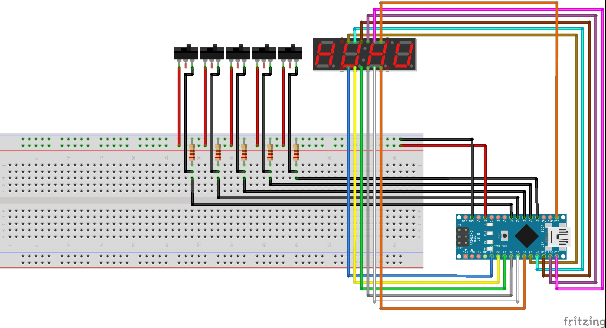

# Binary Number Interaction

The Binary Number Interaction is a mini game that was developed for my Master Thesis "Developing a Support Infrastructure for an Escape The Room and Peddy Paper Games". 

This mini game, or interaction as I so call it, was developed to be part of an Escape the Room game that was also developed as part of my thesis. Since this interaction can work as a standalone mini game I decided to place it here for anyone interested in using it.

## List of Components
- Toggle Switch (5x);
- 4-Digit 7-Segment Display (1x);
- Arduino Nano (1x);

In order to fully assemble the Interaction, so as to look like the picture below, you will also need to 3D Print the enclosure which is divided into two parts that can be found [here](enclosure/).

## The Purpose of The Game

The way this game works is very simple, in the 4-Digit 7-Segment Display a number, between 1 and 31, appears (This limitation was imposed due to the number of toggle switches used in the making of the interaction) and the player must convert that decimal number into its binary equivalent using the toggle switches.

Each switch corresponds to the significance of the bit with the far left switch corresponding to the most significant bit (2^4) and the far right switch corresponding to the least significant bit (2^0).

### Example

As an example lets say that the number **27** appeared on the display. The toggle switches all **start in the OFF position (flipped down)**. To complete this mini game you will have to flip up the switches to match the following setup:

| Switch 4    | Switch 3    | Switch 2 | Switch 1 | Switch 0
| :---------: | :---------: | :---------: | :---------: | :---------: |
| ON          | ON          | OFF          | ON          | ON          |

This setup is equivalent to the binary number 11011 which is equal to the decimal number 27.

## Instructions

First start by uploading the code to your Arduino Nano (This is the one I used so I can only guarantee proper working with this micro-controller). 

### Starting the Game

To start the mini game you must first type in the Arduino IDE serial monitor the following:

- `COM:START;ID:123456789`

When you correctly solve the mini game it will send a message to the serial monitor saying the following: 

> `COM:INTERACTION_SOLVED;MSG:User Introduced Correct Binary Number;PNT:2000`

## WARNING

The source code for this interaction contains a lot of logic that was made to communicate with the infrastructure that was developed for my thesis and therefor it is not as clean as it could be when compared to a mini game that is developed with the intent of being used by the Arduino IDE directly.
